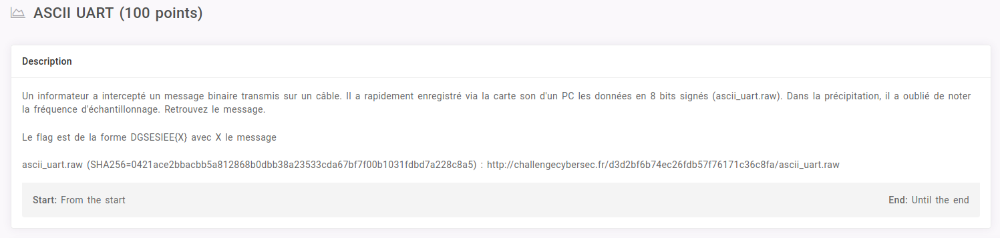

# ASCII UART



```python
$ for n in $(./get_flag ); do python -c "print int('$n', 2)"; done
$ for n in $(./get_flag ); do python3 -c "from bitstring import BitArray; b = BitArray(bin='$n'); print(b.int)"; done
```