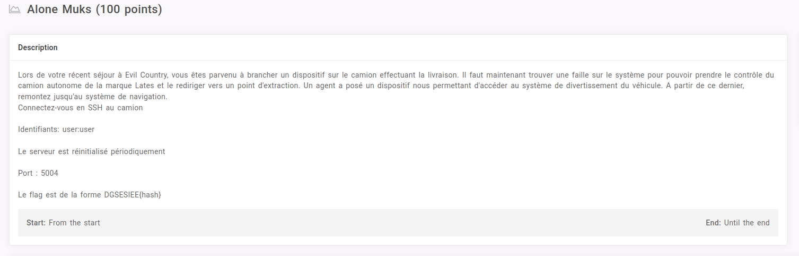
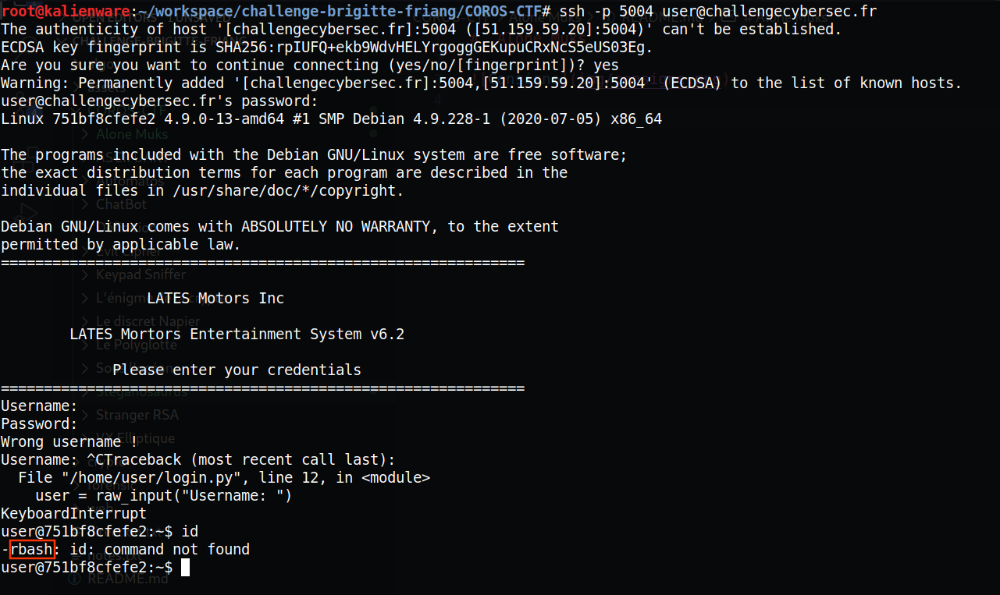
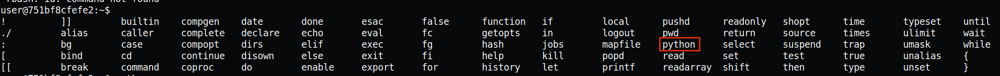
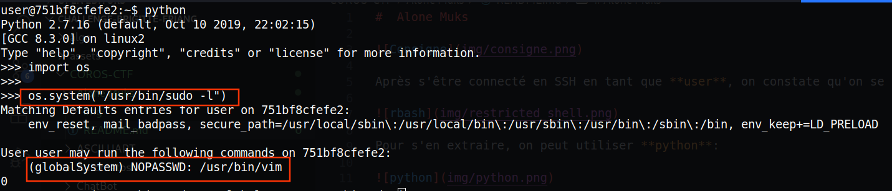
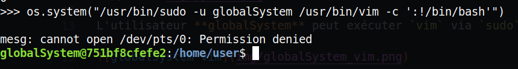
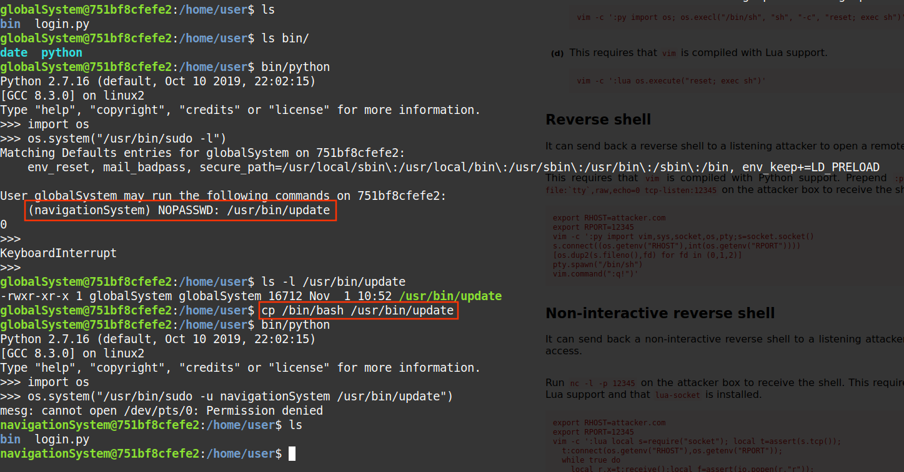
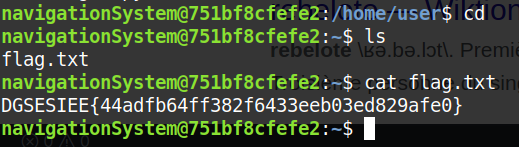

#  Alone Muks

Après s'être connecté en SSH en tant que **user**, on constate qu'on se retrouve dans un restricte shell:

Pour s'en extraire, on peut utiliser **python**:

L'utilisateur **globalSystem** peut exécuter `vim` via `sudo`:

Il est donc possible d'obtenir un shell:

Rebelote pour l'utilisateur **navigationSystem**:

Il est donc possible de lire le fichier flag.txt: `DGSESIEE{44adfb64ff382f6433eeb03ed829afe0}`

## Liens utiles

- [**gtfobins**: `vim`](https://gtfobins.github.io/gtfobins/vim/)