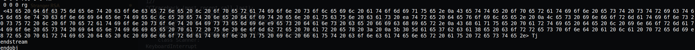
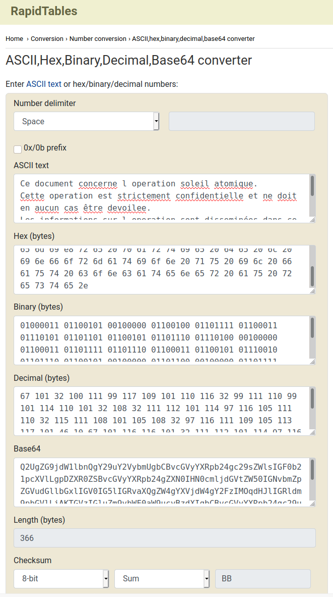
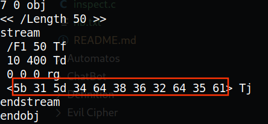
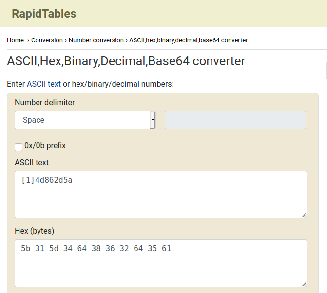

# Le Polyglotte​


`_4aee=7<e5:`


Via `strings message.pdf`, on peut voir également plusieurs chaîne de carcatères en hexadécimal telle que celle-ci: 



Il est possible de les convertir via le site suivant [https://www.rapidtables.com/convert/number/ascii-hex-bin-dec-converter.html](https://www.rapidtables.com/convert/number/ascii-hex-bin-dec-converter.html):



"Ce document concerne l operation soleil atomique.
Cette operation est strictement confidentielle et ne doit en aucun cas être devoilee. 
Les informations sur l operation sont disseminées dans ce fichier.
Chaque partie de l information est identifiee par un nombre par ex : 
[0]ae7bca8e correspond a la première partie de l information qu il faut concatener au reste."

Si on ne fait pas le `+4` du JS, on obtient `[0]aa938a16`:

```js
flag = [91,48,93,97,97,57,51,56,97,49,54]

console.log(String.fromCharCode.apply(String, lag))
```

- 1. `[0]aa938a16` | `_4aee=7<e5:`

D'autre part






- 2. `[1]4d862d5a` | `_5a8h<:6h9e`

aa938a164d862d5a


~~DGSESIEE{aa938a164d862d5a}~~