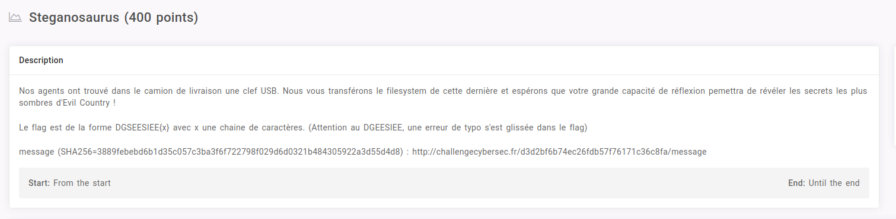

# Steganosaurus



```bash
$ fls -r -p message 
r/r * 4:	flag.png
r/r 6:	readme
r/r 9:	steganausorus.apk
d/d 11:	.Trash-1000
d/d 1224070:	.Trash-1000/info
r/r 1224087:	.Trash-1000/info/flag.png.trashinfo
r/r * 1224090:	.Trash-1000/info/flag.png.trashinfo.M0J1S0
d/d 1224072:	.Trash-1000/files
r/r 1224102:	.Trash-1000/files/flag.png
v/v 4193795:	$MBR
v/v 4193796:	$FAT1
v/v 4193797:	$FAT2
V/V 4193798:	$OrphanFiles
$ 
```