# Challenge Brigitte Fiang

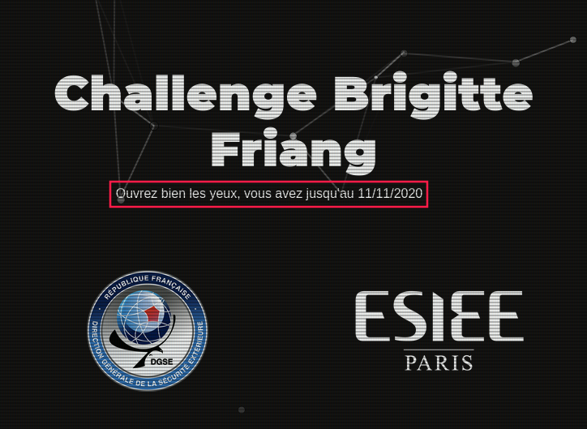


## Chall 0: HTML source code

En inspectant les sources de https://challengecybersec.fr/(https://challengecybersec.fr/) on tombe sur le commentaire suivant: 

```html
<!--/static/message-secret.html-->
```

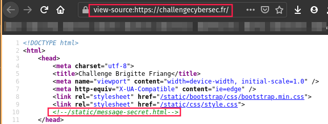

Lorsqu'on se rend  l'adresse [https://challengecybersec.fr/static/message-secret.html](https://challengecybersec.fr/static/message-secret.html), on obtient le texte suivant:


"Zp cvbz whyclulg h spyl jl tlzzhnl, j'lza xbl cvbz wvbclg ylqvpukyl s’vwlyhapvu «Iypnpaal Myphun». Ylqvpnulg-uvbz yhwpkltlua.

Iypnpaal Myphun lza bul ylzpzahual, qvbyuhspzal la ljypchpul myhujhpzl. Lssl lza ull sl 23/01/1924 h Whypz, lssl h 19 huz zvbz s'vjjbwhapvu svyzxb'lssl lza yljyball wbpz mvytll jvttl zljylahpyl/jopmmylbzl why bu hnlua kb IJYH, Qlhu-Myhujvpz Jsvbla klz Wlyybjolz hsphz Nhspsll jolm kb Ibylhb klz vwlyhapvuz hlypluulz (IVH) kl sh Ylnpvu T (Jval kb Uvyk, Mpupzalyl, Pukyl la Svpyl, Vyul, Zhyaol, Svpyl pumlyplbyl, Thpul la Svpyl, Tvyipohu, Clukll). Iypnpaal Myphun bapspzl whymvpz klz mvbshykz wvby jhjoly klz jvklz. Jvtwslalg s’BYS hclj s’pumvythapvu xbp lza jhjoll khuz jl tlzzhnl.

Zbpal h s’hyylzahapvu la sh ayhopzvu kl Wplyyl Thubls, Iypnpaal Myphun lza hyylall why sh Nlzahwv. Lssl lza islzzll why ihssl lu aluahua kl z’lumbpy la lza jvukbpal h s’Ovwpahs kl sh Wpapl. Klz ylzpzahuaz alualyvua kl sh spilyly thpz zhuz zbjjlz. Lssl lza avyabyll la ul kvuulyh whz k'pumvythapvuz. U’vbisplg whz sh ihyyl vispxbl. Lssl lza luzbpal lucvfll khuz sl jhtw kl Yhcluziybjr.

Hwylz zvu ylavby kl klwvyahapvu, lssl whyapjpwl h sh jylhapvu kb Yhzzltisltlua kb wlbwsl myhuçhpz (YWM). Lssl pualnyl sh wlapal lxbpwl, hbavby k'Hukyl Thsyhbe, xbp ch wylwhyly sl kpzjvbyz mvukhalby kl Zayhzivbyn lu 1947 la slz lsljapvuz slnpzshapclz kl 1951.

Lssl yluayl h s'VYAM, la klcplua jvyylzwvukhual kl nblyyl. Lssl viaplua zvu iylcla kl zhba lu whyhjobal la hjjvtwhnul klz jvtthukvz kl whyhjobapzalz lu vwlyhapvu kbyhua sh nblyyl k’Pukvjopul. Lssl yhjvual zvu lewlyplujl khuz Slz Mslbyz kb jpls (1955). K'hbaylz hnluaz zvua zby sl jvbw hb tvtlua vb ql cvbz whysl. Slz tlpsslbyz k'luayl cvbz zl kvuulyvua yluklg-cvbz h s'Lbyvwlhu Jfilydllr h Yluulz wvby bul yltpzl kl wype. Ylzvsclg sl wsbz k'lwylbclz hchua sh mpu kl jlaal tpzzpvu la alualg kl nhnuly cvayl wshjl whytp s'lspal! Why sh zbpal, lssl jvbcyl s’lewlkpapvu kl Zblg, sh nblyyl klz Zpe Qvbyz la sh nblyyl kb Cpla Uht. Lssl wyluk wvzpapvu lu mhclby k'bul hbavuvtpl kb qvbyuhspztl khuz sl zlycpjl wbispj jl xbp sbp chba k'layl spjlujpll kl s'VYAM.

Lssl ljypa wsbzplbyz spcylz la altvpnul kl s'lunhnltlua klz mlttlz khuz sh Ylzpzahujl"

A en croire le titre de la page, il s'agit très certainement d'un **chiffrement de César**:

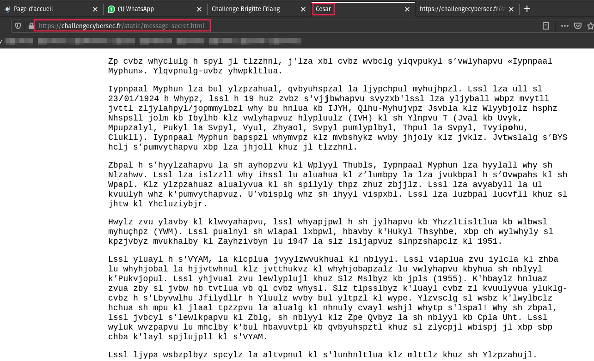

## Chall 1: Caesar Cipher (ROT19 )

Sur [https://rot13.com/](https://rot13.com/), on se rends compte qu'il s'agit d'un message chiffré en **rot19**:

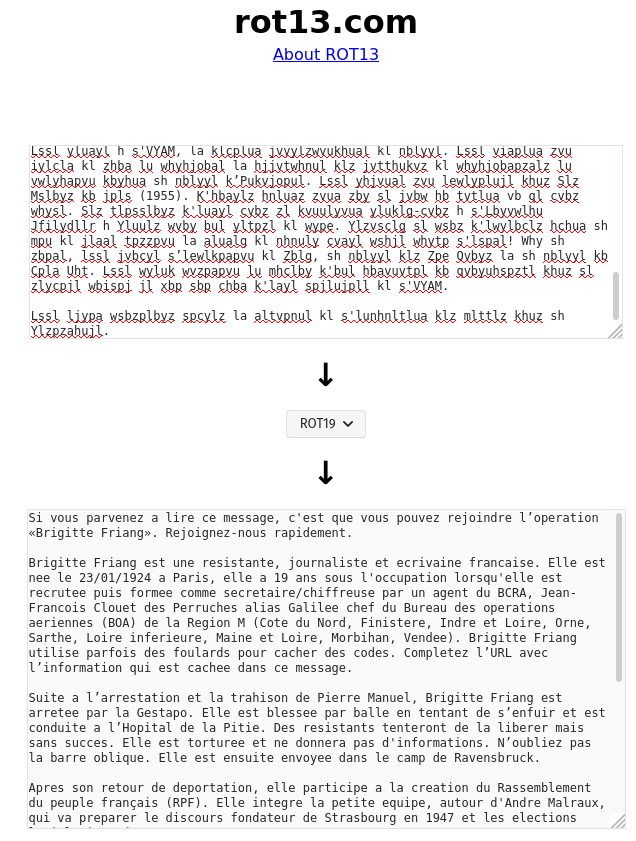

"Si vous parvenez a lire ce message, c'est que vous pouvez rejoindre l’operation «Brigitte Friang». Rejoignez-nous rapidement.

Brigitte Friang est une resistante, journaliste et ecrivaine francaise. Elle est nee le 23/01/1924 a Paris, elle a 19 ans sous l'occupation lorsqu'elle est recrutee puis formee comme secretaire/chiffreuse par un agent du BCRA, Jean-Francois Clouet des Perruches alias Galilee chef du Bureau des operations aeriennes (BOA) de la Region M (Cote du Nord, Finistere, Indre et Loire, Orne, Sarthe, Loire inferieure, Maine et Loire, Morbihan, Vendee). Brigitte Friang utilise parfois des foulards pour cacher des codes. Completez l’URL avec l’information qui est cachee dans ce message.

Suite a l’arrestation et la trahison de Pierre Manuel, Brigitte Friang est arretee par la Gestapo. Elle est blessee par balle en tentant de s’enfuir et est conduite a l’Hopital de la Pitie. Des resistants tenteront de la liberer mais sans succes. Elle est torturee et ne donnera pas d'informations. N’oubliez pas la barre oblique. Elle est ensuite envoyee dans le camp de Ravensbruck.

Apres son retour de deportation, elle participe a la creation du Rassemblement du peuple français (RPF). Elle integre la petite equipe, autour d'Andre Malraux, qui va preparer le discours fondateur de Strasbourg en 1947 et les elections legislatives de 1951.

Elle rentre a l'ORTF, et devient correspondante de guerre. Elle obtient son brevet de saut en parachute et accompagne des commandos de parachutistes en operation durant la guerre d’Indochine. Elle raconte son experience dans Les Fleurs du ciel (1955). D'autres agents sont sur le coup au moment ou je vous parle. Les meilleurs d'entre vous se donneront rendez-vous a l'European Cyberweek a Rennes pour une remise de prix. Resolvez le plus d'epreuves avant la fin de cette mission et tentez de gagner votre place parmi l'elite! Par la suite, elle couvre l’expedition de Suez, la guerre des Six Jours et la guerre du Viet Nam. Elle prend position en faveur d'une autonomie du journalisme dans le service public ce qui lui vaut d'etre licenciee de l'ORTF.

Elle ecrit plusieurs livres et temoigne de l'engagement des femmes dans la Resistance."

## Chall 2: Chat

> **Completez l’URL avec l’information qui est cachee dans ce message.**

On constate dans le code HTML que certaines lettres sont en gras:

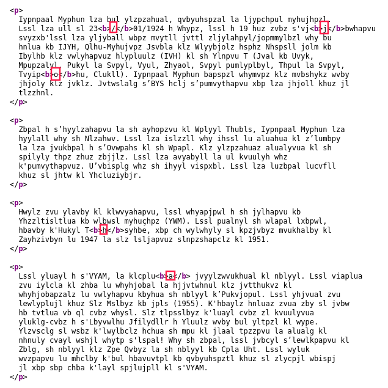

`/joha` est l'equivalent de `/chat` en rot19.

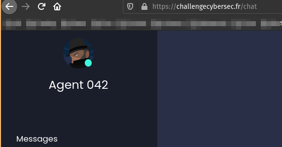

___


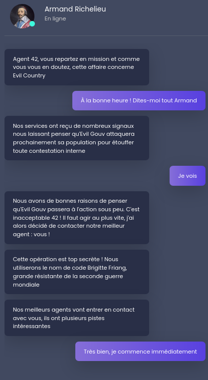

## Crypto

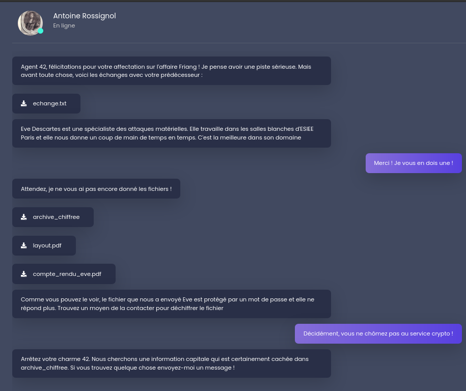

## Web

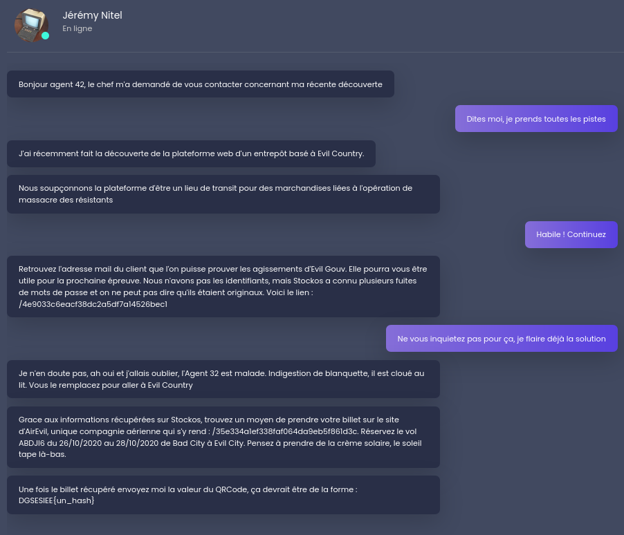

## Algo

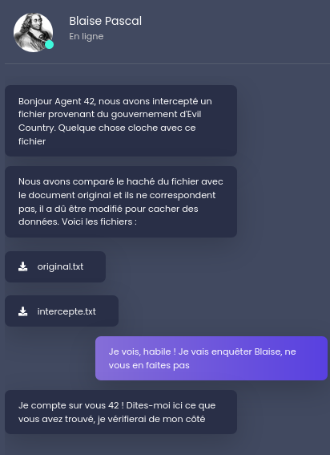

## Forensic

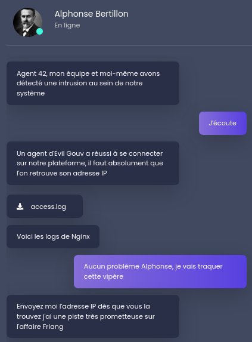

